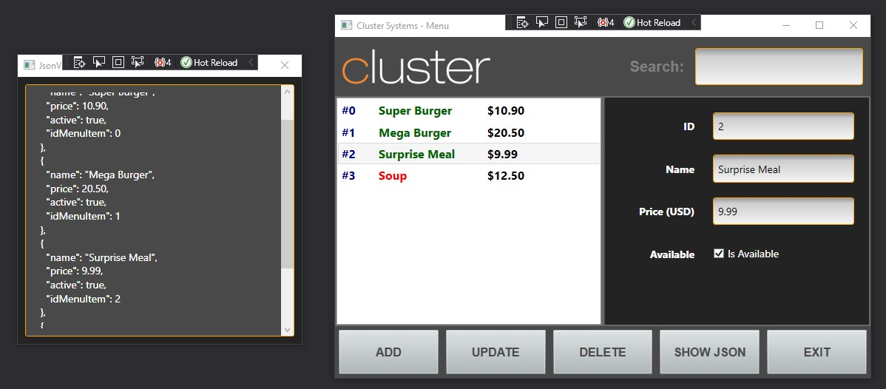

# Summary

This is a small MVVM app, using WPF windows application, that can browse a restaurant menu.
The application does not actually store data but provides interfaces and patterns for easy database implementation.

# Screenshot

# Author

Giovani Luigi R. B.
